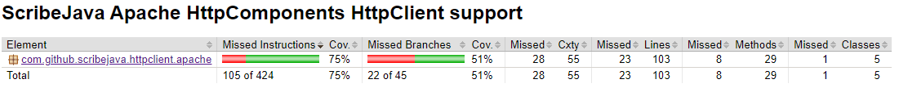
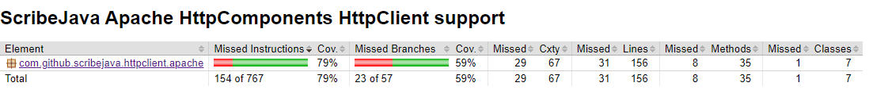

# Report for Assignment 1

## Project chosen
Name: cribeJava
URL: https://github.com/scribejava/scribejava
Number of lines of code and tool used to count it: 17332, lizard
Programming language: Java

## Coverage measurement
### Existing tool
Name of the existing tool used was Jacoco. It was executed by adding a Jacoco plugin into the pom.xml file and then executing maven. (Add some details)
(Provide screenshot, there is a problem that it only creates reports for specific parts such as scribejava-core, figure out a way to put it all in one report)

### Our own coverage tool
Tomas Busa
Function 1: com.github.scribejava.httpclient.apache.ApacheHttpClient.getRequestBuilder

Function 2: com.github.scribejava.httpclient.apache.OAuthAsyncCompletionHandler.completed

Jayran Duggins
Function 1: scribejava-httpclient-armeria/src/main/java/com/github/scribejava/httpclient/armeria/ArmeriaHttpClient.java (getHttpMethod)

Function 2: scribejava-httpclient-armeria/src/main/java/com/github/scribejava/httpclient/armeria/ArmeriaWebClientBuilder.java (newWebClient)

Nikola Bakalinov
Function 1: scribejava/scribejava-httpclient-ning/src/main/java/com/github/scribejava/httpclient/ning
/NingHttpClient.java  (doExecuteAsync)

